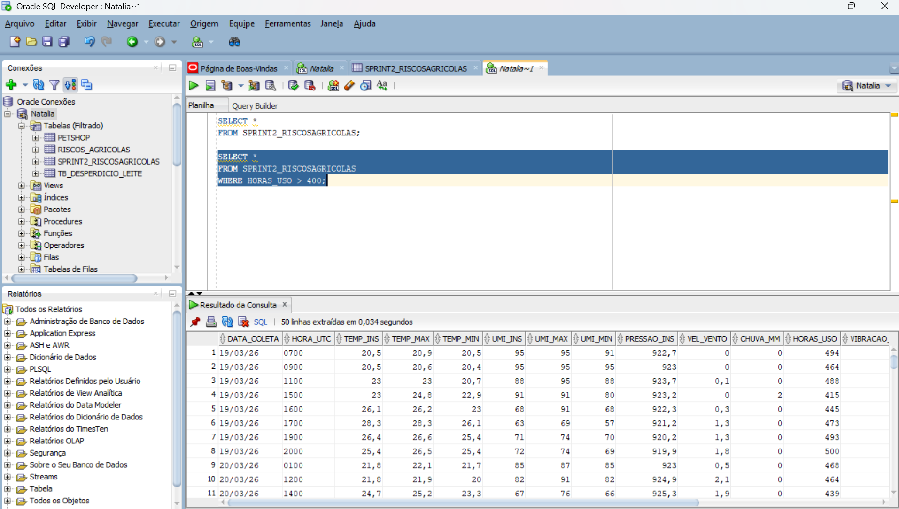
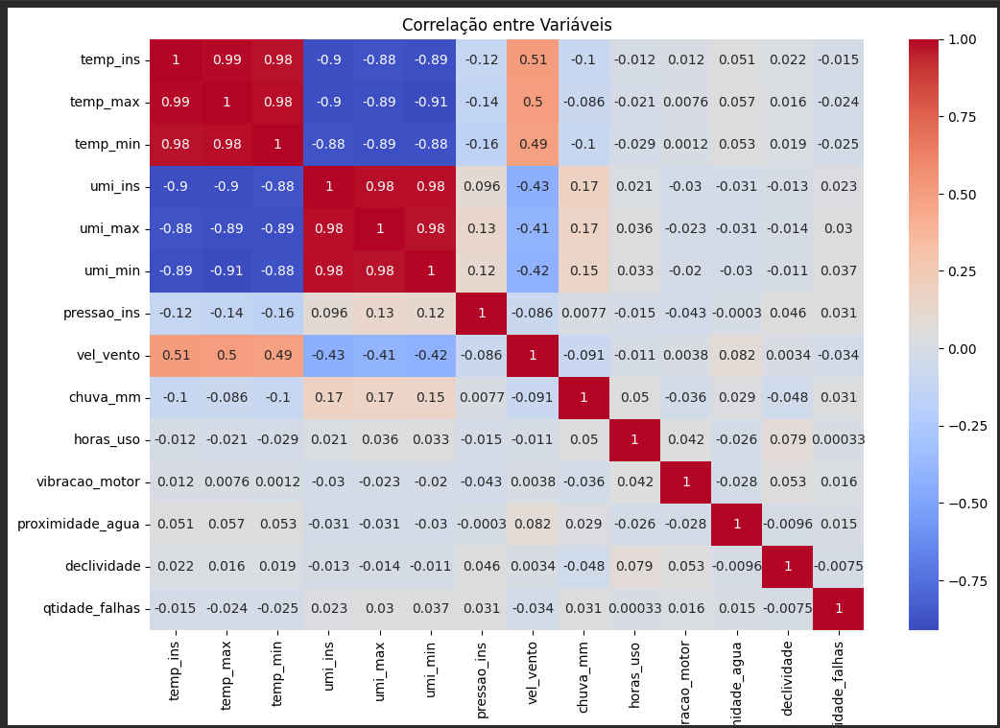
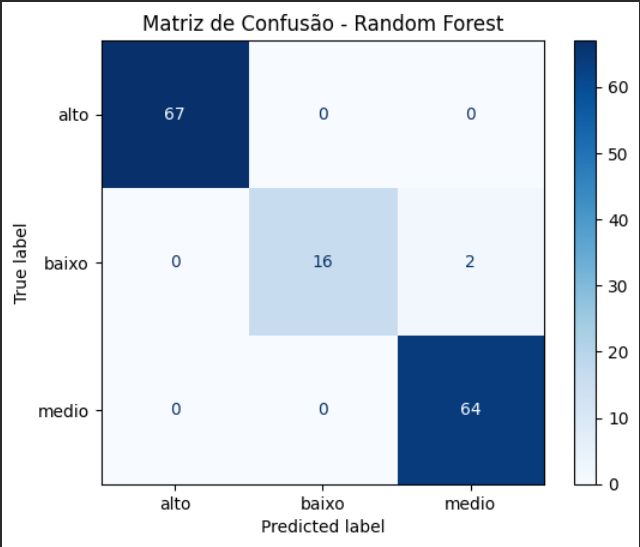
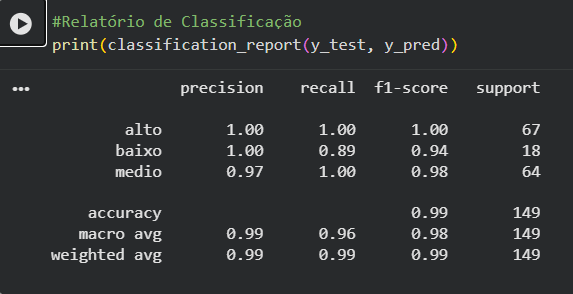

FIAP - Faculdade de Informática e Administração Paulista

# 🌱 Challenge Sompo - Previsão de Riscos em Equipamentos Agrícolas

## 👨‍🎓 Integrantes

Natalia de Lima Faro - RM 568610

## 📌 Status do Projeto

| Sprint | Status |
|---|---|
| 1 | ✅ Concluída |
| 2 | ✅ Concluída |
| 3 | 🚧 Em desenvolvimento |

## 👩‍🏫 Professores

---

## 📜 Descrição do Projeto

Este projeto tem como objetivo desenvolver uma solução baseada em dados e Inteligência Artificial capaz de identificar, prever e reduzir riscos operacionais e ambientais relacionados ao uso de equipamentos agrícolas.

No cenário atual, muitas decisões no campo ainda são tomadas de forma reativa, ou seja, apenas após a ocorrência de falhas ou acidentes. Isso pode gerar altos custos operacionais, danos aos equipamentos e riscos à segurança.

A proposta deste projeto é transformar esse modelo reativo em um modelo preventivo, utilizando dados como clima, tipo de solo, localização e histórico de uso para antecipar situações de risco e apoiar a tomada de decisão de operadores, gestores e seguradoras.

---
# 📌 Sprint 1 — Estruturação da Solução

## Apresentação

Acesse a apresentação completa do projeto:

👉 [Visualizar apresentação](Sprint1/Arquitetura_de_Sistema.pdf)

---

## ⚠️ Problema

Equipamentos agrícolas operam em ambientes altamente variáveis e sujeitos a riscos, como:

* Solo instável após chuvas
* Proximidade de áreas alagadas
* Condições climáticas adversas
* Falta de manutenção preventiva

Atualmente, há baixa previsibilidade desses riscos, o que resulta em:

* Aumento de custos com manutenção
* Perda de equipamentos
* Interrupção de operações
* Riscos de acidentes

---

## 💡 Solução Proposta

Desenvolver uma plataforma inteligente que:

* Integra dados ambientais e operacionais
* Analisa padrões de risco
* Gera alertas preventivos em tempo real
* Fornece recomendações para evitar incidentes

### Funcionalidades principais:

* 🚨 Alertas de risco (baixo, médio, alto)
* 📊 Score de risco (0 a 100)
* 📍 Recomendações operacionais (ex: evitar área)
* 📈 Dashboard com visão geral dos riscos

---

## Personas
### Operador

* Atua diretamente no campo
* Precisa evitar acidentes e falhas
* Utiliza alertas rápidos e objetivos

### Gestor Agrícola

* Responsável pela operação
* Busca reduzir custos e otimizar processos
* Precisa de relatórios e visão consolidada

### Seguradora (Sompo)

* Avalia e gerencia riscos
* Define políticas de seguro
* Utiliza dados históricos e previsões

---

## Estrutura de Dados

A solução utilizará dados simulados representando variáveis ambientais e operacionais.

> **Os dados utilizados neste projeto são simulados, construídos com base em padrões reais observados no setor agrícola e em variáveis que influenciam diretamente o risco operacional, como clima, solo, uso do equipamento e histórico de falhas.**


Acesse o dataset utilizado no projeto:

[Download do dataset](Sprint2/dataset_riscos_agricolas.xlsx)


### Variáveis consideradas:

* Clima (temperatura, umidade, chuva)
* Solo (tipo, inclinação)
* Localização (proximidade de água)
* Operação (campo ou transporte)
* Uso do equipamento
* Histórico de falhas

---

## Modelo de IA (Proposta Inicial)

Será utilizado um modelo de **classificação de risco**, com base nos dados coletados.

### Abordagem:

* Tipo: Classificação (baixo, médio, alto)
* Entrada: variáveis ambientais + operacionais
* Saída:

  * Categoria de risco
  * Score de risco

### Modelos sugeridos:

* Random Forest
* Regressão Logística

---

## Arquitetura da Solução

### Fluxo da Solução:

Sensores / APIs → Coleta de Dados → Banco de Dados → Modelo de IA → API → Dashboard

### Componentes:

* 📡 Sensores (IoT) para coleta de dados
* 🌐 APIs externas (clima)
* 🗄️ Banco de dados (SQL ou NoSQL)
* 🤖 Modelo de Machine Learning (Python)
* 📊 Dashboard (Power BI ou aplicação web)


## Interface

A solução contará com:
* Dashboard com:

  * Visualização de risco por equipamento
  * Indicadores em tempo real
  * Histórico de eventos

* Alertas:
  * Alto risco de atolamento
  * Evitar operação em determinada área

## Segurança

* Controle de acesso por usuário
* Proteção de dados sensíveis
* Garantia de integridade das informações

## 📅 Planejamento das Próximas Sprints

### Sprint 2
* Criação do dataset
* Análise exploratória dos dados

### Sprint 3
* Desenvolvimento do modelo preditivo

### Sprint 4
* Desenvolvimento do dashboard

## 🎥 Vídeo de Apresentação

Link do vídeo (YouTube): https://youtu.be/6ZY3w8G3FbI

---

# 🚀 Sprint 2 — Implementação Técnica e Inteligência Preditiva

## 📌 Objetivo da Sprint 2
A Sprint 2 tem como objetivo transformar a proposta conceitual desenvolvida na Sprint 1 em uma solução técnica integrada, conectando coleta de dados, armazenamento em banco SQL e modelos de Inteligência Artificial.

Nesta etapa, o foco principal é implementar a inteligência de dados da solução, permitindo a análise preditiva de riscos operacionais em equipamentos agrícolas por meio da integração entre dados climáticos reais, variáveis operacionais simuladas e modelos supervisionados de Machine Learning.

Além disso, a Sprint 2 busca demonstrar o fluxo completo da solução, desde a ingestão dos dados até a geração de scores de risco, alertas preventivos e visualizações em dashboards.

## 🎯 Personas e Visões Atendidas pela Solução

A solução proposta foi desenvolvida para atender diferentes perspectivas envolvidas na operação agrícola e na gestão de riscos da seguradora.

### Seguradora Sompo e sua visão

A seguradora atua na análise e mitigação de riscos relacionados às operações agrícolas, buscando reduzir sinistros e melhorar a previsibilidade operacional dos segurados.

Seu principal desafio é antecipar situações de risco antes da ocorrência de danos ou perdas operacionais.

A solução utiliza dados climáticos, operacionais e históricos para geração de análises preditivas e scores de risco, permitindo uma atuação preventiva baseada em Inteligência Artificial.

Com isso, torna-se possível:

- Reduzir custos relacionados a indenizações;
- Melhorar a análise de risco dos segurados;
- Aumentar a previsibilidade operacional;
- Apoiar auditorias e rastreabilidade dos eventos.

### Gestor Agrícola e sua visão

O gestor agrícola é responsável pelo acompanhamento operacional da frota e pela tomada de decisão estratégica relacionada à produtividade e manutenção dos equipamentos.

Seu principal desafio é reduzir custos operacionais e evitar interrupções causadas por falhas inesperadas ou operação em áreas críticas.

A solução oferece suporte à tomada de decisão operacional por meio de dashboards consolidados, visualização de riscos por equipamento e região, além de indicadores preventivos que auxiliam no planejamento das operações e da manutenção.

Com isso, os principais benefícios incluem:

- Redução de custos operacionais;
- Planejamento preventivo de manutenção;
- Monitoramento de áreas de risco;
- Visualização consolidada das operações;
- Maior previsibilidade operacional da frota.

### Usuário Final/Operador e sua visão

O operador atua diretamente no campo durante as operações agrícolas e enfrenta diariamente condições variáveis de clima e solo, muitas vezes sem informações suficientes para avaliar os riscos operacionais da área.

Seu principal desafio é evitar situações como atolamentos, falhas mecânicas e acidentes durante a operação dos equipamentos.

A solução auxilia o operador por meio de alertas preventivos e classificações de risco em tempo real, permitindo decisões mais seguras sobre continuidade da operação, mudança de rota ou interrupção temporária da atividade.

Com isso, a solução contribui para:

- Redução de acidentes operacionais;
- Prevenção de atolamentos e falhas mecânicas;
- Melhor tomada de decisão em campo;
- Maior segurança durante as operações agrícolas;
- Apoio preventivo em situações de risco elevado.

---
## 🔄 Evolução em Relação à Sprint 1
Na Sprint 1, o projeto foi estruturado de forma conceitual, incluindo definição do problema, arquitetura inicial, personas, variáveis de risco e proposta de solução baseada em Inteligência Artificial.

Já na Sprint 2, o projeto evolui para uma abordagem prática e funcional, incorporando:

- Integração de dados climáticos reais extraídos do INMET;
- Estruturação de datasets operacionais para análise preditiva;
- Implementação de banco de dados SQL para persistência das informações;
- Desenvolvimento inicial do modelo de Machine Learning;
- Geração de scores de risco e classificações preventivas;
- Construção de dashboards e evidências visuais da solução.

Com isso, o projeto deixa de ser apenas conceitual e passa a demonstrar tecnicamente a viabilidade da arquitetura proposta.

## 📊 Dataset Integrado: INMET + Dados Simulados
O dataset utilizado na Sprint 2 combina dados meteorológicos reais extraídos do Instituto Nacional de Meteorologia (INMET) com variáveis operacionais simuladas relacionadas ao uso de equipamentos agrícolas. 

Os dados climáticos reais foram coletados da estação meteorológica de Avaré/SP, no período de 01/03/2026 a 31/03/2026, incluindo variáveis como:

- Temperatura;
- Umidade do ar;
- Precipitação (chuva);
- Pressão atmosférica;
- Velocidade do vento.

Link: https://tempo.inmet.gov.br/TabelaEstacoes/A001

Esses dados foram integrados a informações simuladas de contexto operacional, como:

- Horas de uso do equipamento;
- Vibração do motor;
- Proximidade de corpos d’água;
- Declividade do terreno;
- Quantidade de falhas anteriores.

A combinação entre dados reais e simulados permite representar cenários agrícolas coerentes com situações de risco operacional, possibilitando análises estatísticas e treinamento de modelos preditivos de classificação de risco.

## 📖 Dicionário de Dados
| Variável | Descrição | Tipo |
|---|---|---|
| Data | Data da coleta meteorológica | Data |
| Hora (UTC) | Horário da medição em UTC | Texto |
| Temp. Ins. (C) | Temperatura instantânea registrada | Numérico |
| Temp. Max. (C) | Temperatura máxima registrada | Numérico |
| Temp. Min. (C) | Temperatura mínima registrada | Numérico |
| Umi. Ins. (%) | Umidade relativa instantânea do ar | Numérico |
| Umi. Max. (%) | Umidade relativa máxima registrada | Numérico |
| Umi. Min. (%) | Umidade relativa mínima registrada | Numérico |
| Pressao Ins. (hPa) | Pressão atmosférica instantânea | Numérico |
| Vel. Vento (m/s) | Velocidade do vento registrada | Numérico |
| Chuva (mm) | Volume de precipitação registrado | Numérico |
| Horas Uso | Quantidade acumulada de horas de uso do equipamento | Numérico |
| Vibração Motor | Índice simulado de vibração do motor | Numérico |
| Proximidade Água (m) | Distância simulada até corpos d’água | Numérico |
| Declividade (°) | Inclinação simulada do terreno | Numérico |
| Qtidade Falhas | Quantidade simulada de falhas anteriores do equipamento | Numérico |
| classificacao_risco | Classificação preditiva do nível de risco operacional | Texto |

### 📌 Origem dos Dados

O dataset utilizado combina:

- Dados meteorológicos reais extraídos do INMET (Instituto Nacional de Meteorologia);
- Variáveis operacionais simuladas para representar condições de uso de equipamentos agrícolas.

Essa abordagem híbrida permite criar cenários coerentes para treinamento e validação de modelos preditivos de risco operacional.

## 🗄️ Banco de Dados SQL

Para a Sprint 2, foi implementada a persistência dos dados utilizando Oracle SQL Developer, permitindo armazenar e consultar informações relacionadas aos riscos operacionais dos equipamentos agrícolas.

A tabela `SPRINT2_RISCOSAGRICOLAS` foi criada para integrar:

- Dados climáticos reais extraídos do INMET;
- Variáveis operacionais simuladas;
- Informações utilizadas posteriormente pelo modelo preditivo de risco.

### Estrutura da Tabela
A tabela foi modelada para armazenar variáveis ambientais e operacionais relevantes para a análise de risco agrícola, incluindo:

- Temperatura;
- Umidade;
- Chuva;
- Pressão atmosférica;
- Velocidade do vento;
- Horas de uso do equipamento;
- Vibração do motor;
- Proximidade de corpos d’água;
- Declividade;
- Quantidade de falhas.

### Script SQL Utilizado
[Visualizar tabela SQL](Sprint2/SPRINT2_RISCOSAGRICOLAS.sql)

### Consulta SQL — Alto Desgaste Operacional
Consulta utilizada para identificar equipamentos com elevado tempo de uso operacional.

```sql
SELECT *
FROM SPRINT2_RISCOSAGRICOLAS
WHERE HORAS_USO > 400;
```

### Resultado da Consulta
Exemplo da execução da consulta no Oracle SQL Developer:


---
## 🏗️ Arquitetura da Solução

A arquitetura da solução representa o fluxo completo dos dados, desde a coleta das informações até a geração de alertas preventivos e visualizações para os usuários finais.

O pipeline contempla:

- Fontes de dados climáticos e operacionais;
- Coleta e integração via sensores e APIs;
- Persistência em banco de dados SQL;
- Processamento e preparação dos dados;
- Modelo preditivo baseado em Random Forest;
- Geração de scores de risco e alertas operacionais;
- Interface de monitoramento em tempo real.

### Diagrama da Arquitetura


---
## 🤖 Modelo Preditivo de IA
- Random Forest
- Acurácia

---
## 📈 Validação Estatística
- Heat Map
- Matriz de Confusão
- Relatório de Classificação
 
 
Durante a Sprint 2, foram realizadas análises estatísticas exploratórias para identificar correlações entre variáveis ambientais e operacionais presentes no dataset.

O objetivo foi compreender como fatores climáticos e operacionais influenciam o comportamento do risco agrícola, permitindo validar a coerência dos dados utilizados no modelo preditivo.

### Heatmap de Correlação
O heatmap abaixo apresenta a matriz de correlação entre as principais variáveis do projeto.

Foi possível identificar:

- Forte correlação positiva entre variáveis de temperatura;
- Forte correlação positiva entre variáveis de umidade;
- Correlação negativa entre temperatura e umidade;
- Relações coerentes entre fatores ambientais e operacionais.



### Notebook Python
O tratamento dos dados e as conversões numéricas foram realizados em Python utilizando Pandas, permitindo a preparação do dataset para análise estatística e treinamento do modelo preditivo.
[Visualizar notebook da análise preditiva](Sprint2/Sprint2_Sompo_Colab.ipynb)

### Modelo Random Forest
Foi utilizado o algoritmo Random Forest para realizar a classificação dos níveis de risco operacional dos equipamentos agrícolas.

O modelo recebeu como entrada variáveis climáticas e operacionais, como temperatura, umidade, chuva, horas de uso, vibração do motor, proximidade de corpos d’água, declividade e histórico de falhas.

A saída do modelo foi a classificação do risco em três níveis: Baixo; Médio e Alto.
A acurácia obtida foi de **98,65%**, indicando bom desempenho do modelo na base utilizada.

### Matriz de Confusão
A matriz de confusão foi utilizada para avaliar o desempenho do modelo Random Forest na classificação dos níveis de risco operacional.

O resultado demonstrou elevada taxa de acerto nas classificações de risco baixo, médio e alto, reforçando a coerência do modelo preditivo.



### Relatório de Classificação

O relatório de classificação foi utilizado para avaliar métricas como precisão, recall e F1-score do modelo Random Forest.

Os resultados demonstraram elevado desempenho do modelo na classificação dos níveis de risco operacional, reforçando a consistência da abordagem preditiva adotada.



---
## ⚙️ Como Executar o Projeto

1. Executar os scripts SQL no Oracle SQL Developer;
2. Importar o dataset integrado;
3. Executar o notebook Python no Google Colab;
4. Gerar métricas e análises estatísticas;
5. Visualizar os resultados do modelo preditivo.

---
## 🎥 Vídeo da Sprint 2


---
## 📁 Estrutura do Repositório

### 📂 Sprint1
Contém os arquivos relacionados à estruturação inicial da solução:

- Arquitetura da solução;
- Definição conceitual do projeto;
- Apresentação da Sprint 1;
- Dataset inicial.


### 📂 Sprint2
Contém os arquivos relacionados à implementação técnica da solução:

- Dataset integrado (INMET + dados simulados);
- Scripts SQL utilizados no Oracle SQL Developer;
- Notebook Python desenvolvido no Google Colab;
- Heatmap de correlação;
- Matriz de confusão;
- Relatório de classificação;
- Evidências visuais da execução do modelo preditivo.


